# GPS Tracker Performance 

The amount of current the GPS uses in a tracker application is an often overlooked issue. The designer may spend a lot of time concentrating on designing a GPS tracker project with an extremely low sleep current without appreciating the amount of power the GPS uses when it is running, acquiring a fix and when its in backup mode.

If a GPS in 'hot fix' mode consumes 50mA (a typical figure) and takes an average of 5 seconds to get a new fix, and you do that every 10 minutes, then in one day it will consume;

50 x 5 x 6 x 24 = 36000maSecs 

or

10mAhr per day. 

Now 10mAhr over a day may not seem a lot, but if the batteries were a pack of AAs then battery life would be less than 280 days.

10mAhr a day is an average current of 416uA, so it seems rather pointless worrying whether a project consumes 10uA in sleep versus striving for 0.1uA or even less. 

Do note that whilst a 'hot fix' of a few seconds may be quoted as the norm, the average 'hot fix' time over a long period will often be 10 seconds or more, as the tests in this article show. 

### GPS Signal Performance

For a range of GPSs I will first measure the signal receiving performance of the GPS. For this we will use the UBLOX U-Center application which when connected to a GPS produces a chart of satellites received and their signal strengths. GPSs with a good signal performance will achieve initial lock quicker, work better in more marginal conditions and will overall require less power to operate. 

U-Center uses the NMEA GSV sentence to obtain the signal strengths of the satellites;

*Signal strength, in dB-Hz (0 - 99)
To compare with SNR values found in Bin messages (such as Bin96) subtract 30 from this signal strength value for an approximate SNR value
SS - 30 = SNR (from Bin message)*

A signal level of 26 or lower is highly marginal and you may not get a fix, or it could take a very long time. A value of 40 or more is a strong signal. If a GPS is receiving 3 or more satellites at this signal level or greater then it can be expected to acquire a fix in 30-50 seconds from cold.

The U-Center application is designed for UBLOX GPSs but it will display satellite information for other GPS makes also. 

In the roof of my workshop (Shed!) I have a clear plastic panel and I placed all the GPSs in turn underneath this on a high shelf. The location was not ideal for good GPS reception but indicative of a slightly marginal situation. 

The GPSs were connected to U-Center in turn and time was recorded for the GPS to acquire its first fix and the current consumption was also measured. 

Modern GPSs should when connected to a decent working antenna get a fix from cold in 30 to 60 seconds. If it takes longer either the GPS or its antenna are faulty or the GPS has a poor view of the sky. You may often see it commented that GPSs can take 15 minutes or even longer to acquire a fix from cold. I assume this in an urban myth maybe based on ancient history. All the GPSs I have tested in recent years stick to the 30 to 60 second rule, unless they are faulty. 

### GPS Backup Performance

As the GPS will normally get a fix from cold in 30 – 60 seconds when it has a good view of the sky, we don't want to run it from cold every time we need a location fix. Fortunately once the GPS has downloaded enough information on the GPS satellites the main GPS power can be turned off and as long as a voltage is supplied to the GPS backup pin the GPS will retain the satellite information in GPS memory. When the GPS power is then turned back on the GPS can acquire an updated fix in as little as 1 – 5 seconds, this is called ‘hot fixing’.

In backup mode the GPS may consume only 5uA to 20uA, so clearly there are significant power savings to be had if we only want intermittent fixes from the GPS. A GPS that only needs to run for a few seconds to get an updated fix every 10 minutes or longer will use a lot less power that an GPS that is left running all the time.

##### GPS Backup with battery

A very common way to supply the backup supply to a GPS is to use a small Lithium battery, typically a Seiko MS621. However this is not without problems, the MS621 has a capacity of only 5.5mAhr and a maximum charge current of 100uA. So when first used with the GPS you need to leave it powered for 55 hours, just over two days, to fully charge the battery. This is not very convenient. In addition you need to consider the cycle time. A typical NEO version UBLOX GPS will consume 15uA in backup mode, so the MS621 will only last 15 days or so when fully charged. The equivalent Quectel GPSs consume around 6uA in backup mode. If the tracker is to use hot fixing for longer than 15 days then the backup battery needs to be charged, or it will just run out and hot fixing will fail.

So why does the backup battery go flat ? If we are taking a GPS fix every 10 minutes and the hot fix takes 5 seconds, there is only 100uA x 5 seconds = 500uA seconds going into the battery. But in 10 minutes there is 10min x 60seconds x 15uA = 9000uA seconds going out. Thus the battery is draining 18 times faster than it is charging and will inevitably discharge quite quickly.

Although fitting an MS621 battery is common with GPS modules, its not suitable as a backup method if the GPS is to be used for a couple of weeks or more in a working tracker. A different backup strategy is needed.

##### GPS Backup with Super Capacitor

If a small lithium battery is not suitable;  what about a super capacitor that can at least be charged fairly quickly so it might accrue enough charge during a short hot fix power on to last for several hours ?

There is a web site which is an on-line super capacitor charge and discharge calculator;

[Super Capacitor Calculator](https://www.maximintegrated.com/en/design/tools/calculators/product-design/supercap.cfm)

First lets see what size of super capacitor we need. Assume a maximum backup time of one day, a fully charged voltage of 3.0V and a minimum volts for GPS backup of 1.5V, a  GPSs backup current of 15uA which is  typical for a UBLOX GPS for instance. The calculator suggests a capacitor of 1 Farad would last a couple of hours longer than one day.

If the hot fix gap was 10 minutes and the hot fix takes 5 seconds with a GPS backup current of 15uA, then assuming no charge\discharge efficiency losses the charge current needs to be 600/5 times the backup current or 1.8mA. That’s manageable.

So if we are to use a 1F super capacitor how big would it be ?

Checking on the Farnell web site a 1 Farad 3.6V super capacitor would be around 20mm in diameter, perhaps a bit more and 5mm high. That’s really quite big, see picture for the size of a 5.5V version of 1F capacitor. The GPS shown is one of the larger 25mm ceramic patch antenna types.

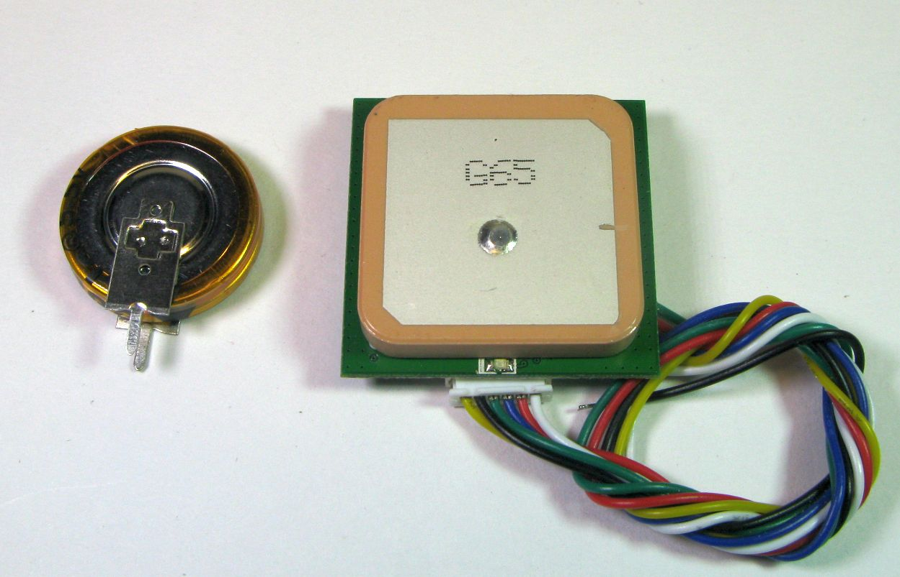

There are some small super capacitors around the same size as the Seiko MS621, but these super capacitors are of very limited capacity and would only provide a couple of hours backup (based on practical tests).

So if a super capacitor is too big to be practical and we have already dismissed small lithium rechargeable, then what is the alternative ?

##### GPS Backup - What to do ?
 

So if we don’t use a a super capacitor or a small lithium rechargeable, then what is the alternative ?

We could of course use a non-chargeable lithium battery such as a CR1216 but in the holders these have much the same issue as the super capacitor, they are physically large, see picture.

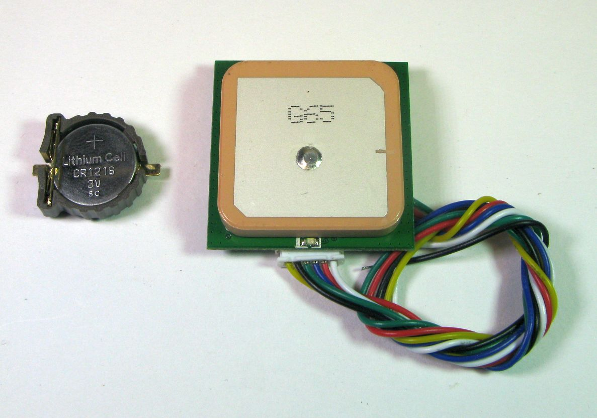

In addition even a battery as physically big as the CR1216 only has a capacity of circa 25mAhr, so that would only keep the GPS (@15uA backup current) going for 70 days. A tracker based on this set-up would need it’s GPS battery replaced around every two months, oops.

The answer to the problem is quite simple really. With the small lithium rechargeable or super capacitor options, then the backup power for the GPS is actually already coming from the projects main battery, so why not use the main battery as the backup power source for the GPS ?

All we need to do is take a 3.3V supply from the project and feed this voltage via a diode to the GPS Vbackup supply. We then need to ensure that the 3.3V supply is present when the project (using the GPS) is in sleep mode. This is not difficult even if the project is using something like a TPL5110 to switch off \on the battery supply to the project. A low drop out regulator such as the MCP1711 has a quiescent current of 0.6uA, so that can be used to go between the projects battery and the GPS Vbackup supply without having a significant impact on total GPS backup current consumption.

Whilst the solution to providing a long term GPS backup current is simple to implement, very few GPS breakout boards provide access to the GPS Vbackup pin, so you cannot feed in an external backup supply. For this reason I designed my own GPS breakout boards for the Quectel L70/L76 and L80/L86 GPS, see below. 

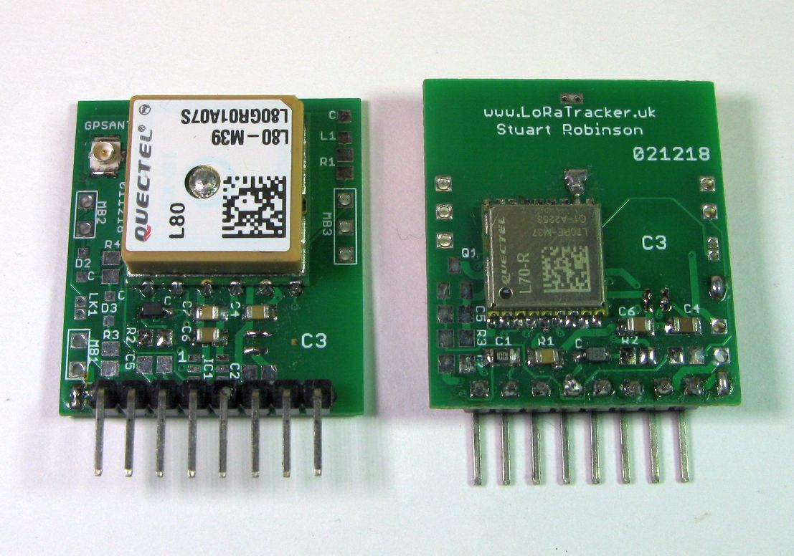 

The L80 GPS turns out to have a slightly worse power performance than the L70, but it has its own ceramic patch antenna and easy to include in PCB designs and solder in place, I like it. The L70 breakout board can be fitted with a simple wire antenna or a stick on ceramic patch antenna on the PCB rear. The L70 has a balloon mode, for use up to an altitude of 80km, most GPSs cease to function above 18km.

**Note:** It should be noted that the vast majority of the GPSs modules mentioned in this report will, if operated over several weeks, revert to cold fix mode due to failure of the backup supplies, that will in turn significantly increase power consumption. 

### GPS Hot Fix Performance

A 'hot fix' takes place when a GPS is powered on or woken up from a software or hardware based sleep mode. If the GPS has a memory backup then it will use the previously downloaded GPS satellite information stored in its memory to quickly establish a new location fix. If there has been little movement across the sky in the GPS satellites that are visible since the last fix, this 'hot fix' can take as little as two seconds. Clearly if the GPS only needs to be on for two seconds this can result in significant power savings. However GPS satellites do move out of view and new ones appear so that over time the GPS will need to download information on new satellites which takes time. Thus whilst initially 'hot fix' times will be very short over a period of hours there will be longer 'hot fix' times, as you will see in the graphs below. 

The UBLOX GPSs can be shut down to around 15uA in backup mode via software alone, which is handy. The Mediateks and Quectel GPSs can also be shut down via software but the backup current only reduces to 1mA or so. 

The only practical way to monitor the actual current consumption of a GPS tracker over a long period is to externally measure the actual mAhr used, if the hot fix time varies a lot its going to be difficult to calculate the figure. As an example it was noted that for one of the UBLOX GPSs used in these tests the hot fix time varied from 2.0 seconds to 32 seconds, its thus very difficult to come up with an average for calculation purposes.   

Some Arduino software was written that powered up the tracker and GPS, recorded how long the fix took, powered down the GPS via software, sent the GPS information at bandwidth 125000Hz and SF12 (worse case for long distance) and transmitted the location packet. The tracker was then powered off completely by a real time clock based **power controller** (DS3231) of my own design;

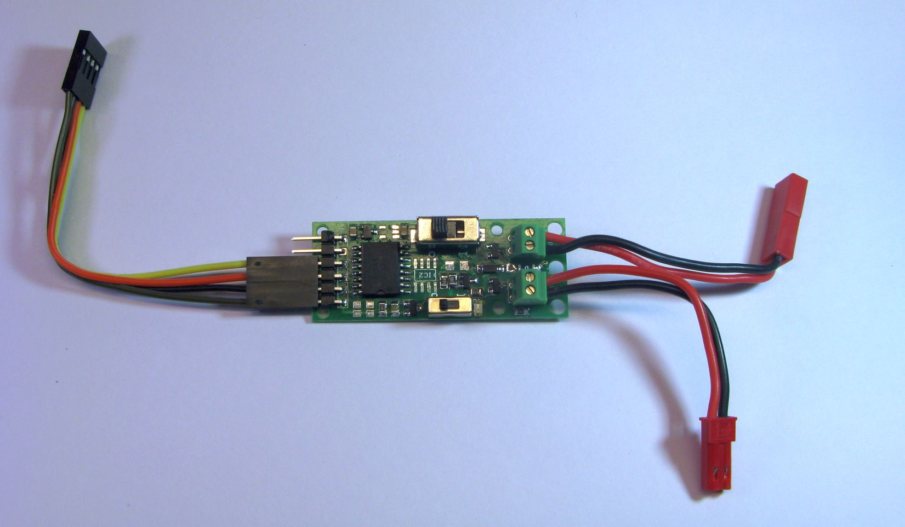
  

The power controller goes in the battery lead of a project and is controlled from the project with a 4 wire I2C lead. Power off time is programmable from seconds to one month. For this GPS test it turned off the tracker for 10 minutes, so this was the GPS location transmission interval. The sleep current for the entire arrangement was 1.5uA. 

A large lead acid gel **battery** feeding a 5V output step down **power converter** was connected to a **USB power meter** which would record the total mAhr being used by the tracker.  

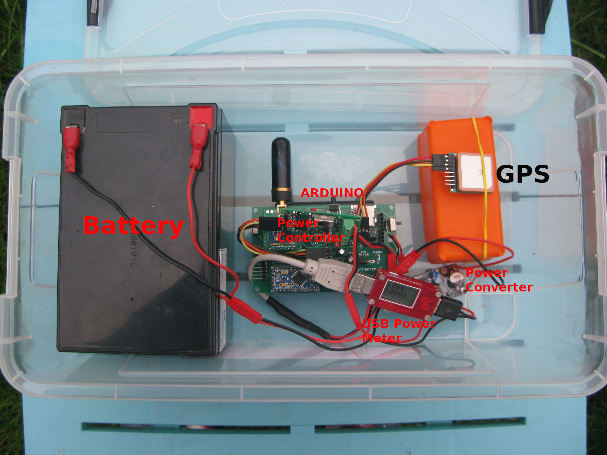

The entire package was placed outdoors in my garden on a table which would be around the height of a tracker when worn by a small animal. 

The Arduino receiver software was written for the Pro Mini based LCD receiver of my own design. It recorded the received packets, including GPS fix time, and reported them to an attached display, serial monitor and micro SD card log. The SD card log format was in CSV so it was straight forward to read to data on the file into a spreadsheet and draw a graph of the variation in fix times. 

**Note:** This report is a work in progress, fix and current data is not yet available for some GPSs.
  
  

### GPS Performance Tests - Report Format

The GPSs were initially tested for signal performance and fix time in 3 batches. Below the testing of each batch is reported starting with a picture of the GPSs. The GPS is named and the information presented in this order, Fix time from cold, current consumption whilst acquiring fix, current consumption after fix, total tracker power used in 24 hours, GPS mAhr used in 24 hours, battery life for a pack of AA Alkalines. To calculate the power just used by the GPS the consumed by the tracker with no GPS was measured. The total up time was 2.91 seconds with a power consumption of 7.2mA when idle and 44mA when transmitting. The transmit time was 0.925 seconds, this equates to 0.0917 mAhr per hour or 2.2mAhr per day. With that figure known it was possible to subtract the figure from the total measured mAhr when the transmissions and GPS were in use in order to isolate the GPS only figure.     

The GPS signal graph is then shown for the GPS, note that green bars mean the satellite is available for fix information blue means it is not.  At the bottom of the bar is the signal strength, and below that the satellite number. 

If the 24 hour hot fix test has been run that is presented next. This graph shows the variation in hot fix times over a 24 hour period. The fixes are every 10 minutes. 
 

### GPS Tests

This is the first set of GPSs';

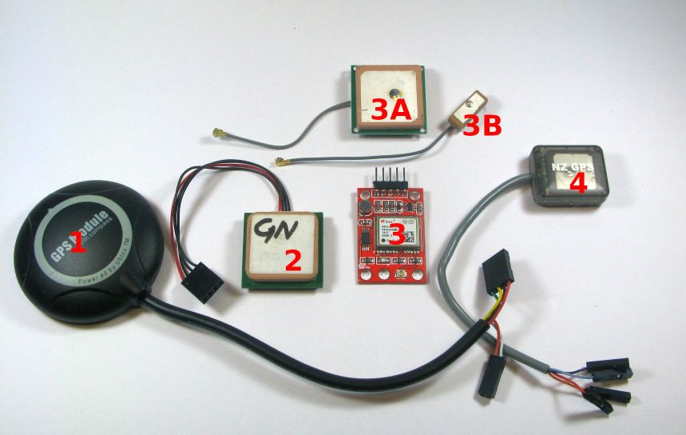

And the respective plots from U-center were are shown below, GPS 3 is a UBLOX6M tested with the large ceramic patch antenna (3A) and the smaller one which is sometimes used (3B).

  

#### 1 - UBLOX 8M GPS
Often used on quad copters and similar.
  

* With 25mm ceramic patch antenna. 
* Fix time from cold, 46 seconds.
* Current whilst acquiring fix, 34mA to 50mA.
* Current after fix acquired, 38mA to 50mA.
* Total Tracker Power in 24 hours, 10 minute fixes, 21.5mAhr
* GPS Power in 24 hours, 10 minute fixes, 19.3mAhr
* Tracker battery life AA Alkalines 133 days

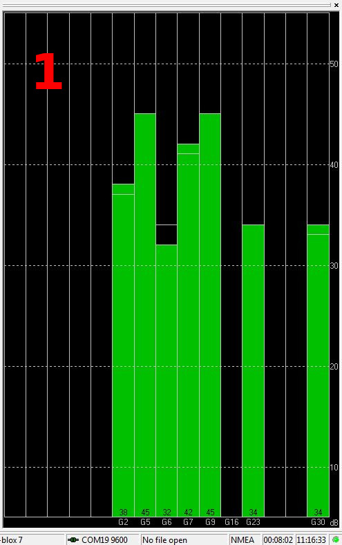

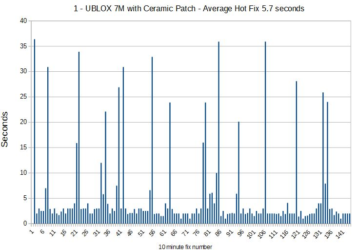

  

#### 2 - UBLOX 7 GPS - Ceramic Patch
* With 25mm ceramic patch antenna. 
* Fix time from cold, 35 seconds.
* Current whilst acquiring fix, 50mA to 54mA.
* Current after fix acquired, 45mA to 56mA.
* Total Tracker Power in 24 hours, 10 minute fixes, 38.1mAhr
* GPS Power in 24 hours, 10 minute fixes, 35.9mAhr
* Tracker battery life AA Alkalines 73 days

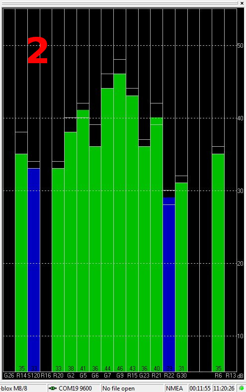

  

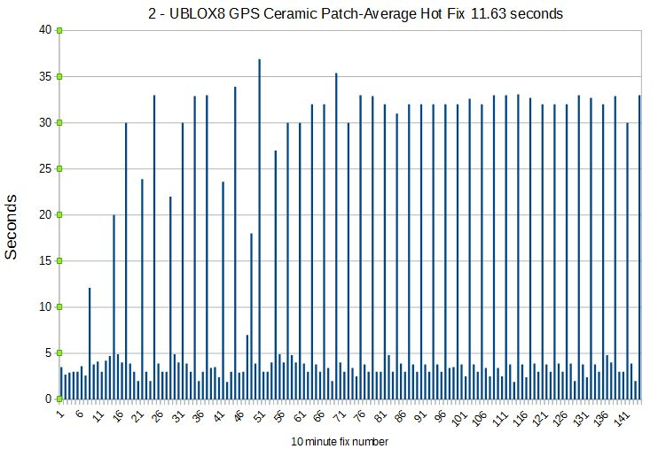
  
  

#### 3A - UBLOX 6M GPS
* With external plug in 25mm ceramic patch antenna.
* Fix time from cold, 35 seconds.
* Current whilst acquiring fix, 50mA to 55mA
* Current after fix acquired, 45mA to 55mA
* Total Tracker Power in 24 hours, 10 minute fixes, 80.7mAhr
* GPS Power in 24 hours, 10 minute fixes, 78.5mAhr 
* Tracker battery life AA Alkalines 35 days
  

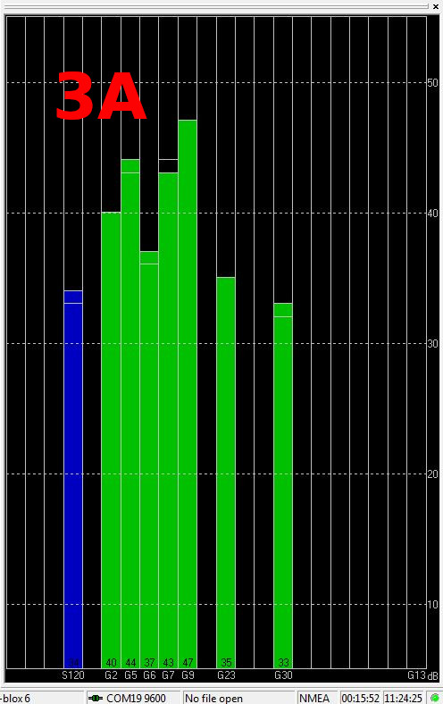
  

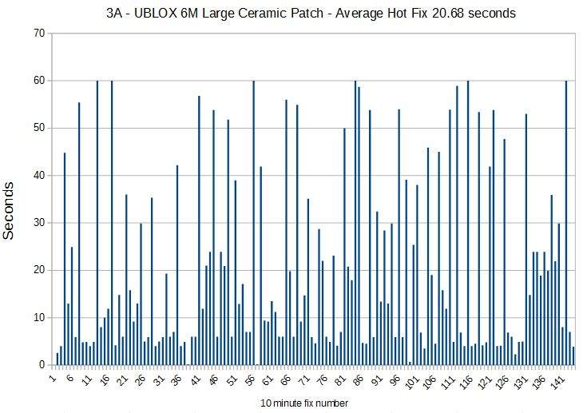

  
#### 3B - UBLOX 6M GPS
* With plug in  mini ceramic patch antenna. Much reduced signals. No fix.

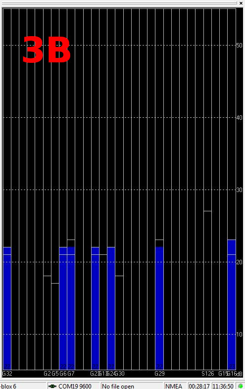

  
#### 4 - unknown type.
* With 18mm ceramic patch antenna.
* Fix time from cold, 25 seconds.
* Current whilst acquiring fix, 38mA to 53mA
* Current after fix acquired, 38mA to 53mA

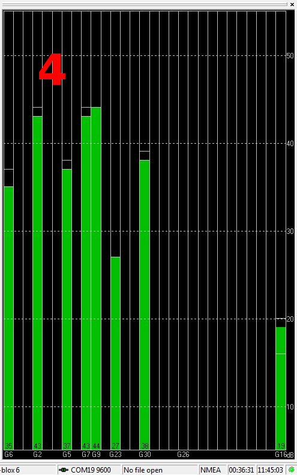

  

### High Altitude Balloon GPSs

**GPSs 5,6 and 7** below are typical types for high altitude balloon (HAB) tracking, all 3 have a high altitude mode allowing operation above 18,000M

At the end of the report there are test results for the Quectel L76, this GPS is similar to the L70 but with the addition of multi GNSS support for GPS, GLONASS, BeiDou, Galileo and QZSS.

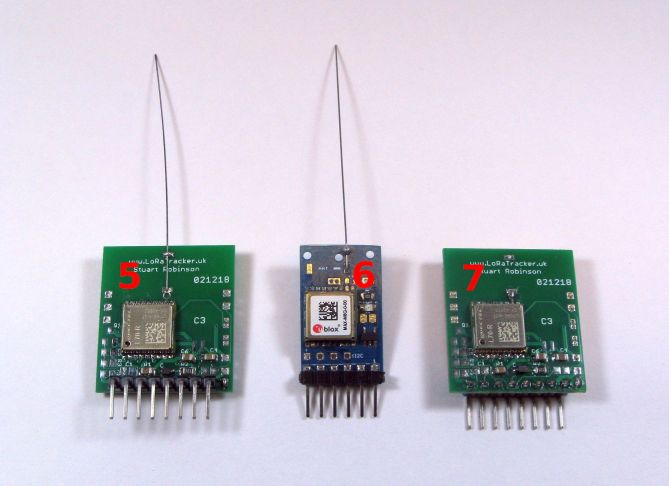

  
  
#### 5H Quectel L70
* With simple horizontal wire antenna.
* Fix time from cold, 32 seconds.
* Current whilst acquiring fix, 14mA to 15mA
* Current after fix acquired, 15mA to 22mA. The L70 is the same size and pin layout as the UBLOX MAXM8Q.
* Total Tracker Power in 24 hours, 10 minute fixes, 17.6mAhr
* GPS Power in 24 hours, 10 minute fixes, 15.4mAhr 
* Tracker battery life AA Alkalines 159 days

  
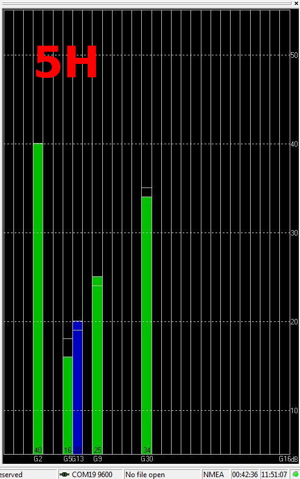
  
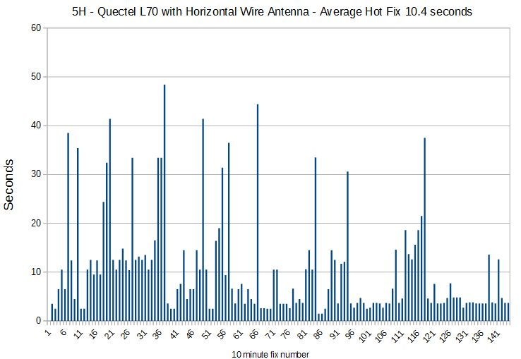
  

#### 5V Quectel L70
* With simple vertical wire antenna. 
* Fix time from cold, 36 seconds.
* Current whilst acquiring fix, 14mA to 15mA
* Current after fix acquired, 15mA to 22mA

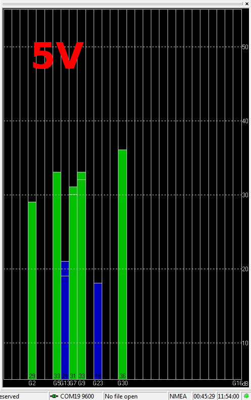

  

#### 6H UBLOX MAXM8Q
The standard high altitude balloon (HAB) GPS perhaps.

* With simple horizontal wire.
* Fix time from cold, 5 minutes 46 seconds.
* Current whilst acquiring fix, 22mA to 28mA
* Current after fix acquired, 20mA to 25mA
  

Breakout board had no connection to Vbackup pin, so could not test hot fix. 
A second example of the MAXM8Q with horizontal wire antenna was tested, Fix time from cold, 7 minutes 35 seconds.

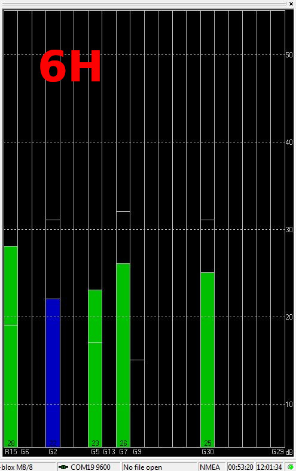
  
  
#### 6V UBLOX MAXM8Q
* With simple vertical wire.
* **No fix acquired in 20 mins**. 
* Current whilst acquiring fix, 22mA to 28mA

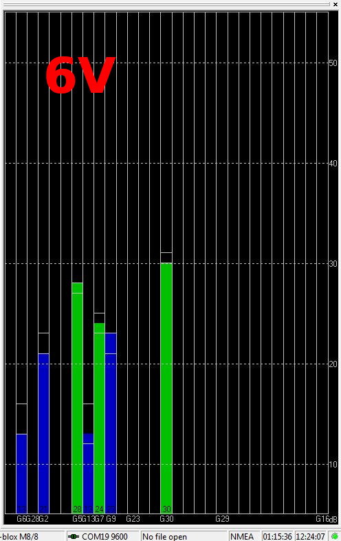
  

  
#### 7 Quectel L70 
* With 25mm ceramic patch on PCB rear.  
* Fix time from cold, 30 seconds.
* Current whilst acquiring fix, 14mA to 15mA
* Current after fix acquired, **11.2 to 14.6mA**
* Total Tracker Power in 24 hours, 10 minute fixes, 15.76mAhr
* GPS Power in 24 hours, 10 minute fixes, 13.56mAhr 
* Tracker battery life AA Alkalines 178 days

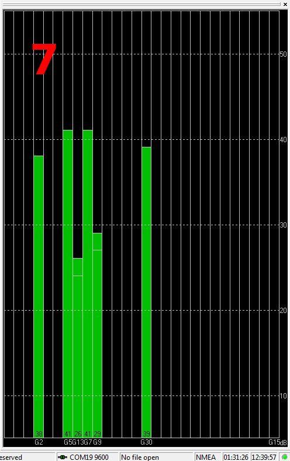

  

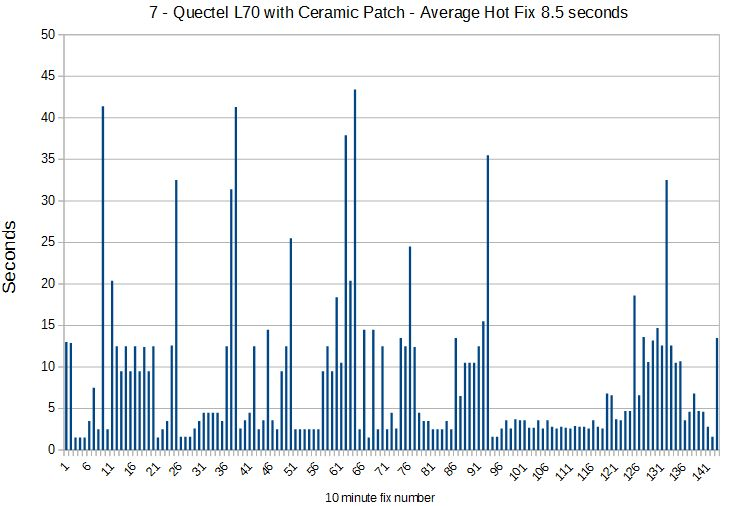

  
  

The next 4 GPS tested are pictured below, No8 is a Quectel L80 module.

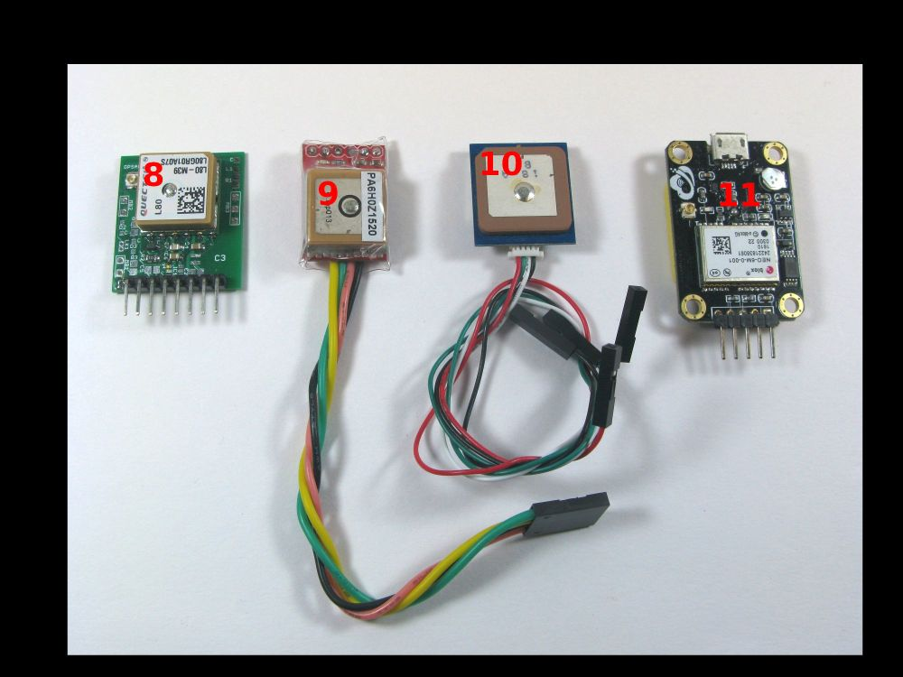
  
  
####  8 - Quectel L80 

* With integral 15mm ceramic patch.  
* Fix time from cold, 30 seconds.
* Current whilst acquiring fix, 21.6mA to 28mA
* Current after fix acquired, 21mA. 
* Total Tracker Power in 24 hours, 10 minute fixes, 19.72mAhr
* GPS Power in 24 hours, 10 minute fixes, 17.52mAhr 
* Tracker battery life AA Alkalines 142 days

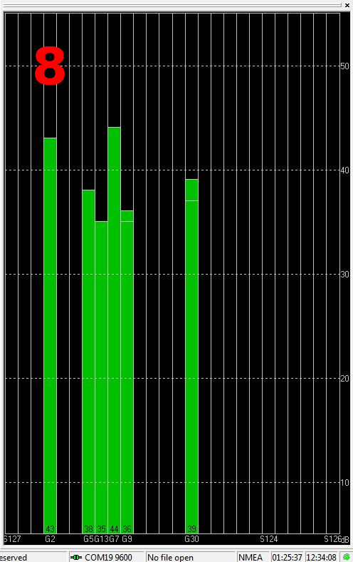
  

  
  

###  9 - GlobalTop PA6H 

* Fix time from cold, 38 seconds.
* Current whilst acquiring fix, 22mA to 23mA.
* Current after fix acquired, 18mA to 25mA.
* Total Tracker Power in 24 hours, 10 minute fixes, 25.8mAhr
* GPS Power in 24 hours, 10 minute fixes, 23.6mAhr 
* Tracker battery life AA Alkalines 109 days

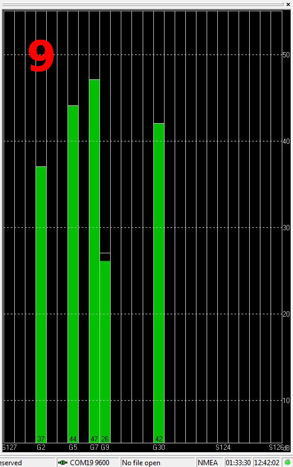

  

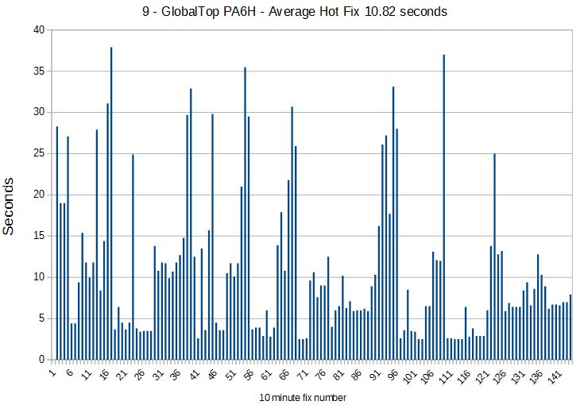

  

####  10 - Beitian BN220 

* Fix time from cold, 38 seconds.
* Current whilst acquiring fix, 47mA to 57mA.
* Current after fix acquired, 47mA to 53mA.
* Total Tracker Power in 24 hours, 10 minute fixes, 80.4mAhr
* GPS Power in 24 hours, 10 minute fixes, 78.2mAhr 
* Tracker battery life AA Alkalines 35 days

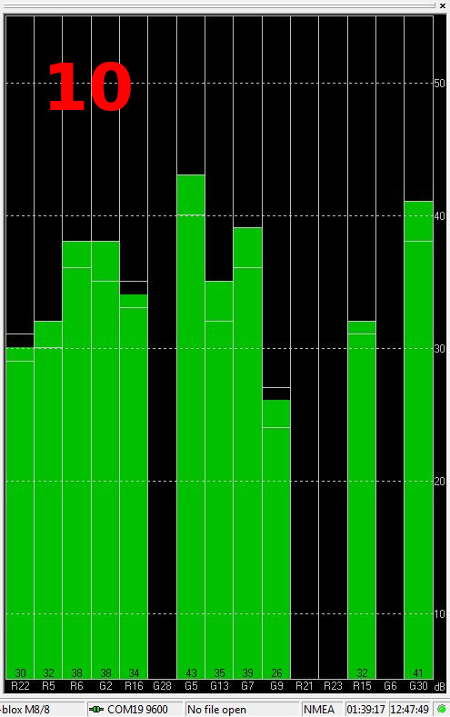

  

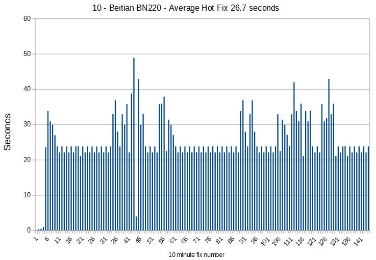

  

####  11 - UBLOX NEO 6M with Ceramic Patch 

* Fix time from cold, 122 seconds.
* Current whilst acquiring fix, 46mA to 56mA.
* Current after fix acquired, 45mA to 57mA.
* Total Tracker Power in 24 hours, 10 minute fixes, 72.2mAhr
* GPS Power in 24 hours, 10 minute fixes, 70mAhr 
* Tracker battery life AA Alkalines 40 days

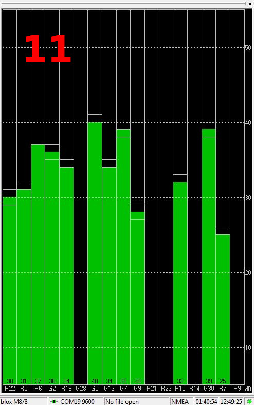

  

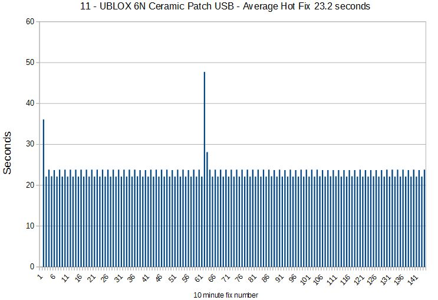

  

The next GPSs to be tested as and when they arrive, I have ordered a UBLOX SAM M8Q, Quectel L76 and Quectel L86. The L76 is in effect an L70 with added  LNA. Whilst the L70 manages well enough without the LNA, the addition ought to improve the hot fix times, reducing in turn the power consumption. The L86 is a GPS with an integral ceramic patch similar in specification to the UBLOX SAM M8Q in that is supports GPS, GLONASS, Galileo and high altitude mode. 

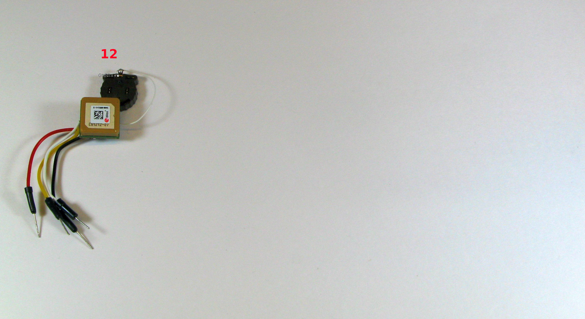

####  12 - UBLOX SAM M8Q with Ceramic Patch 

* Fix time from cold, 36 seconds
* Current whilst acquiring fix, 26mA to 28mA.
* Current after fix acquired, 26.5mA to 30mA.
* Total Tracker Power in 24 hours, 10 minute fixes, 14.32mAhr
* GPS Power in 24 hours, 10 minute fixes, 12.12mAhr 
* Tracker battery life AA Alkalines 195 days

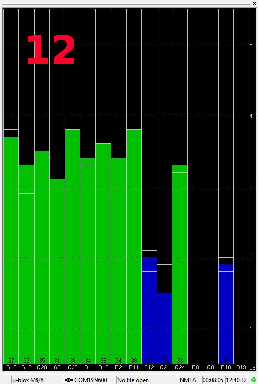

  

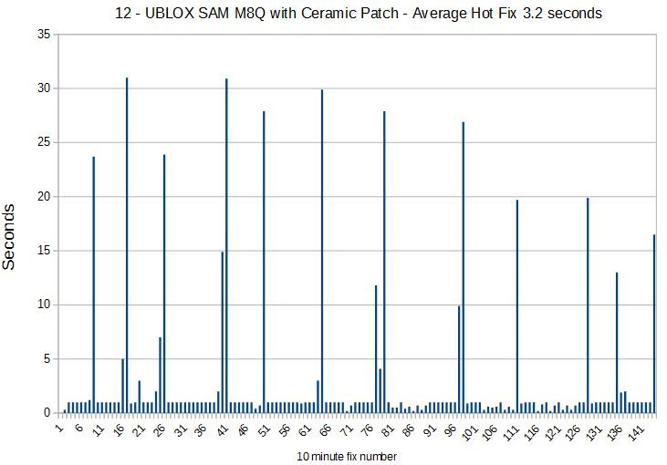
  

####  13 - Quectel L76 with horizontal wire antenna

The Quectel L76 is a GPS similar to the L70 but with the addition of multi GNSS support for GPS, GLONASS, BeiDou, Galileo and QZSS.

* Fix time from cold, 35 seconds
* Current whilst acquiring fix, 26mA to 40mA.
* Current after fix acquired, 19mA to 33mA.
* Total Tracker Power in 24 hours, 10 minute fixes, 20.9mAhr
* GPS Power in 24 hours, 10 minute fixes, 18.7mAhr 
* Tracker battery life AA Alkalines 133 days

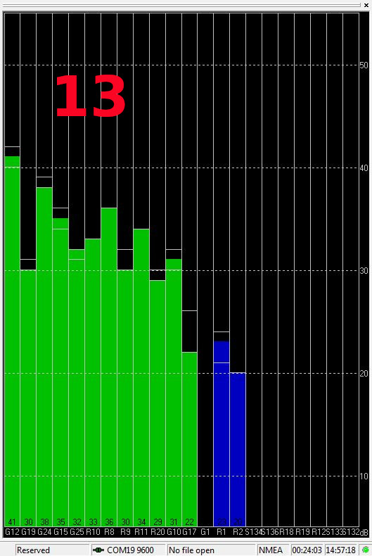

  

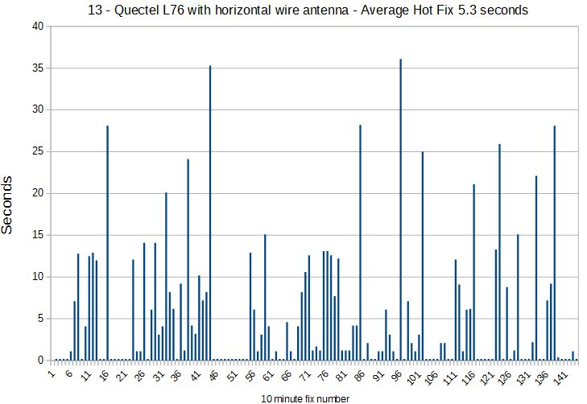
  
####  13 - Quectel L76 - with horizontal wire antenna - 60 second shutdown. 

To test the performance of the L76 that might be typical of a high altitude balloon tracker, I used my DS3231 power controller to shut the tracker down every 60 seconds. The tracker was waking up, waiting for a fix and then transmitting the location with LoRa at a bandwidth of 125Khz and spreading factor of 12. This is approximately 300bps. 

In 24 hours the tracker consumed 145mAh of battery.

The spread of fixes is shown below. 

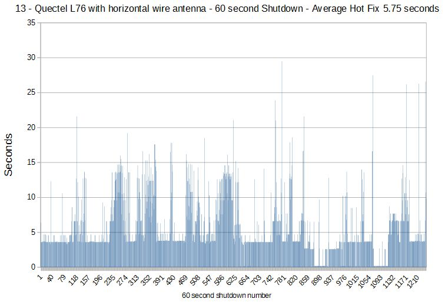

  

####  14 - Quectel L86 with ceramic patch antenna

The Quectel L86 is a GPS similar to the L80 but with the addition of multi GNSS support for GPS, GLONASS, BeiDou, Galileo and QZSS.

* Fix time from cold, 48 seconds
* Current whilst acquiring fix, 30mA to 44mA.
* Current after fix acquired, 23mA to 37mA.
* Total Tracker Power in 24 hours, 10 minute fixes, 27.7mAhr
* GPS Power in 24 hours, 10 minute fixes, 25.2mAhr 
* Tracker battery life AA Alkalines 102 days

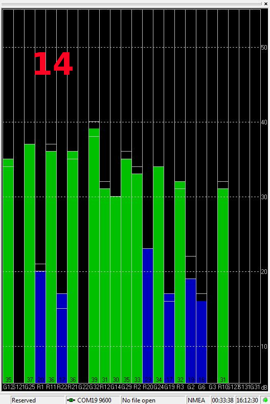

  

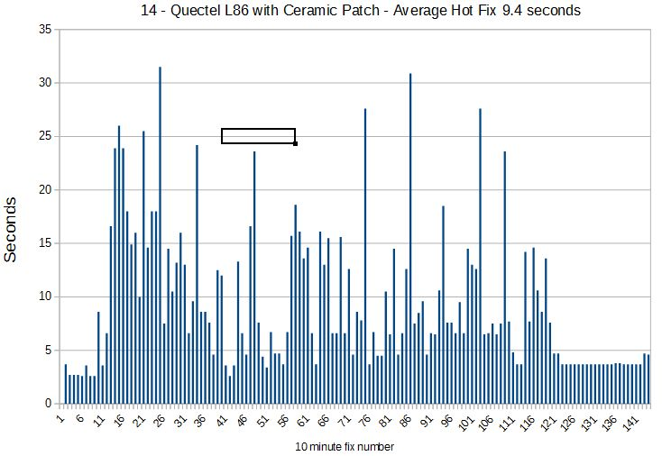

  

####  Quectel L76 with Wire versus Ceramic patch antenna

The Quectel L76 has a built in LNA and so should cope well with a simple wire antenna or a small ceramic patch antenna. The fix performance with a wire antenna was tested earlier, but below is the signal performance of the GPS first with a wire antenna (left) and a small 15mm ceramic patch antenna. The ceramic patch antennas are stick on an easy to fix in place on the rear side to the GPS. The Wire antenna provides a bit more signal gain but at 4.75cm long may not be suitable in some applications. The ceramic patch is much more compact yet still give adequate performance.

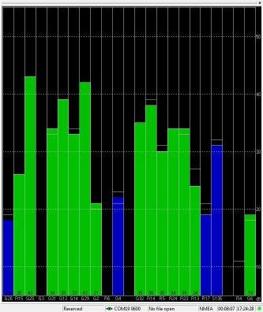 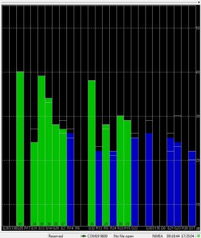

  

### GPS Performance Tests - Summary 

The best performer was the UBLOX SAM M8Q with a battery life of 195 days on AA Alkalines. Its not a low cost GPS however, £18 upwards. 

In the performance tests the Quectel GPSs all did well considering their  very low cost. They had substantially lower power consumption than similar or higher priced UBLOX GPSs.

The Quectel L80 is physically a similar GPS to the SAM M8Q, has a very good performance and at £3.50 is much cheaper than the UBLOX. Its also in a package that makes soldering to a PCB easy. The Quectel L80 perhaps the best compromise GPS.

The bare bones L70 module (i.e. it comes with no antenna) is worthy of note, it's the same size and pin layout as the equivalent UBLOX MAXM8Q module but has a far better signal performance and a very low current consumption. The L70 has a high altitude balloon mode, and is easy to find as a bare module. I recently bought 5 off for £3.50 each delivered. Under the same signal conditions as the UBLOX MAX M8Q the L70 with a simple wire antenna behaved like a standard GPS with ceramic patch antenna; a cold fix time of 32 seconds whilst the UBLOX MAX M8Q took 5 minutes or more. 

The Quectel L76 and L86 are pin compatible with the L70 and L80 respectively and whilst they add multi GNSS capability they are slightly more expensive and use more power. Both these GPSs have a high altitude balloon mode.   

It should be noted that over a long period hot fix times are in the 10 second average range for most GPSs, this is far more than the often quoted headline figures of 2 - 5 seconds. It can be seen from the graphs that there are occasional fixes that take 30 seconds or more. These long fix times are required to download ephemeris data from new satellites that come into view. The detail of this data is constantly changing so you cannot store it long term.  

It also need to be appreciated just how much power a GPS based project actually uses. Even for the low power UBLOX SAM8Q and Quectels, the GPS was consuming more than 85% of the projects power, the rest being used for the LoRa transmissions. 

With the GPS consuming so much of a projects current it is clear that the trackers sleep current is of very little consequence, even at a 'high' level of 5uA, which is easy to achieve with standard Arduino parts, the sleep current is only 1% of the total project current.   

This report notes the importance of having access to the Vbackup pin on the GPS for long term tracker use. There is one GPS module available that provides access to this pin, the [Adafruit Ultimate GPS](https://www.adafruit.com/product/746). I have not tested this GPS, cost is £37, but it should have a similar performance to no. 9 in this report.

  

## Reducing Tracker node sleep current - a wasteful race to the bottom ?

There is quite a lot of significance being attached to reducing the sleep current of LoRa IOT type projects or nodes to extremely low levels, the lower the better apparently, but is sleep current alone a significant factor ? 

A bare bones ATMega328P or 1284P based node with a LoRa module can be used in normal deep sleep mode and the sleep current is around 0.2uA, you can wake up from an external interrupt. Add a regulator such as MCP1700 if you need one, and total sleep current is around 1.5uA with a TPL5010 acting as a watchdog and interrupt wake up device.

A popular alternative to the processor deep sleep approach appears to be to use the TPL5110 device to completely power down a node, in periods from seconds to 2 hours. This set-up has a deep sleep current of less than 0.1uA. This appears to be a significant improvement on the 1.5uA of a bare bones ATMega328P in deep sleep mode, or is it ? Is concentrating or being obsessed with the deep sleep current the best way of reducing overall power consumption  ?

Take a look at the scope plot below, it shows (top trace) the power to a The Thing Network (TTN) GPS tracker node based on an Arduino 8Mhz Pro Mini being turned on. The lower trace shows a logic pin being sent high at the point the tracker node software queued the packet ready to send, so the difference is the node wakeup time. The delay from power on to ready to send the packet was 1512mS, mainly caused by the Arduino boot loader delay. Power consumption during this 1512mS was 5.42mA.  

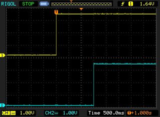

Now compare a similar situation where the tracker node is put into deep sleep and woken up by an interrupt timer such from the TPL5010. The bare bones Arduino with decent regulator and LoRa device has a deep sleep current of circa 1.5uA. Note carefully the time it takes to wake up from deep sleep and be ready to send another packet;

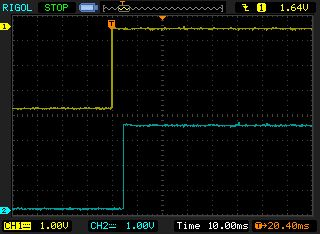

Here the top trace the interrupt waking the tracker node from deep sleep and the bottom trace shows the same logic pin going active just before packet transmission. The delay here is a meagre 4.5mS. 

So the deep sleep wakeup is very much quicker (4.5mS versus 1512mS) but does the quicker ‘boot’ time save power?

Its easier to consider the numbers here in terms of uA/Seconds rather than mAhr and look at the numbers over a day. Lets assume our tracker node sends a transmission every 10 minutes or 144 times a day. 

### TPL5110 Power Down Node

The TPL5110 equipped node (with power down) has a sleep current of 0.1uA so uses 0.1 x 60 x 60 X 24 = 8640uA/Seconds per day during sleep.

At every wakeup it uses 1.512 x 5420 = 8195uA/Seconds per wakeup.

There are 144 of these transmissions, so that is 1180080uA/Seconds per day. 

So our TPL5110 equipped node uses 8640 + 1180080 = 1188720uA/Seconds per day sleeping and waking up,  or 0.33mAhr per day.

### TPL5010 Deep Sleep Interrupt Wakeup Node

A TPL5010 equipped node (interrupt wakeup) has a sleep current of 1.5uA so uses 1.5 x 60 x 60 x 24 = 129600uA/Seconds per day during sleep.

At every wakeup it uses 0.0045 x 5420 = 24.4uA/Seconds per wakeup.

There are 144 of these transmissions, so that is 3513uA/Seconds per day.

So the TPL5010 node uses 129600 + 3513 = 133113uA/Seconds per day sleeping and waking up,  or 0.037mAhr per day. So although the TPL5010 has a higher sleep current over the TPL5110 power down node, it uses far less power. 

### Arduino Boot Loader

Of course we don't have to use the Arduino boot loader to load sketches, we can use an ISP programmer although its less convenient. 

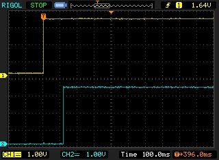

Here the delay between power applied and ready to send a packet is much less; 120mS. 

### Other Advantages of the TPL5010?

The TPL5010 can act as a watchdog device, if you don't respond to the periodic interrupt in a timely fashion then there will be a reset of the processor, which is useful protection against software crashes or power supply induced errors. 

One additional advantage capitalises on the Arduinos quick wakeup from deep sleep. At 4.5mS it becomes feasible to set the TPL5010 to say a one minute interrupt wakeup and then count the interrupts to get in effect a programmable wakeup time. A simple loop counting 10 of the interrupt wake ups then gets you a 10 minute wakeup, without the need to change the TPL5010 timing resistor. 

### Tracker node sleep current - Conclusion?

Using the TPL5110 to power down node a node (with Arduino serial boot loader installed) does give you a very low headline grabbing sleep current of maybe 0.1uA or even less but because of the extended wakeup times this can equate to 0.33mAhr per day sleeping and waking. 

With the processor powered in deep sleep using a TPL5010 as an interrupt wakeup timer use far less, 0.037mAhr per day, simply because the start-ups are very much quicker. So they are significant power savings to be had using a bare bones Arduino set-up and the TPL5010 as a wakeup timer.  If you remove the Arduino serial boot loader then there is not a lot to choose between the two methods, although the TPL5010 does provide added flexibility. 

There is a far more flexible option than the TPL5110 approach, you can build a bare bones ATMega based tracker with LoRa device and use a DS3231 real time clock as a wakeup timer, this provides programmable wakeup times from seconds to one month. You also have the benefit of an accurate real time clock on the tracker. A prototype tracker set-up this way running from a single LifePO4 (3.6V) battery has a sleep current of 0.9uA. 

#### To be continued
  

## Stuart Robinson
## www.LoRaTracker.uk
## January 2019
 